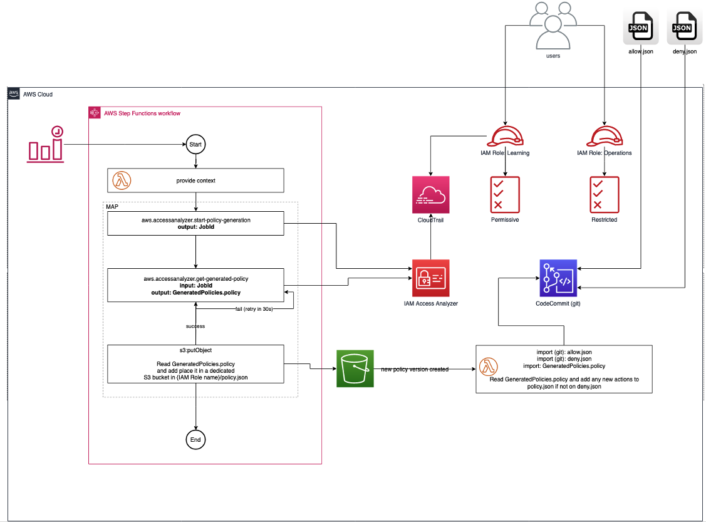

# Automated IAM Access Analyzer Role Policy Generator

Automated IAM Access Analyzer Role Policy Generator is a sample implementation of a periodical monitoring of an AWS IAM Role in order to achieve a continuous permission refinement of that role. The goal of the solution is to present an operational, continuous least-privilege approach for a particular role in order to provide for security proliferation in an ongoing manner.

The target architecture of the of the implementation is presented in the diagram below. Having an example IAM Role *Learning* that is to be periodically scanned, the implemented solution creates a CodeCommit entry with the result being the output of the IAM Access Analyzer's policy generation. Then the administrators of the account in which the solution works can create an updated IAM Role *Operations* that has the permissions defined in the output.



Automated IAM Access Analyzer Role Policy Generator relies on the [AWS CloudTrail](https://aws.amazon.com/cloudtrail/), [AWS IAM Access Analyzer for policy generation](https://docs.aws.amazon.com/IAM/latest/UserGuide/access-analyzer-policy-generation.html), and [AWS Step Functions](https://aws.amazon.com/step-functions/) for orchestrating the overall process.

## Structure of the solution

The solution includes two implementations of the same functionality: 

- an implementation using [AWS CDK](https://aws.amazon.com/cdk/) that can be deployed as a [CloudFormation](https://aws.amazon.com/cloudformation/) stack 
- an implementation using [CDK for Terraform](https://www.terraform.io/cdktf) that can be deployed as [Terraform](https://www.terraform.io/) IaC

These stack creation implementations rely on the *worker* lambdas:

- `initialize-repository` - a lambda for setting up a repository with a preliminary `allow.json` and `deny.json` files (residing in `repo/` directory)
- `provide-context` - a helper lambda providing lookup window for the 

## Building the solution

1. Use NodeJS 14 or above
2. Install [lerna](https://lerna.js.org/) globally (npm i -g lerna)
3. In the root directory of the solution run


```
npm install && npm run bootstrap
```

4. Test & build the Lambda code

```
npm run test:code
npm run build:code
npm run pack:code
```

5. Build the constructs
```
npm run build:infra
```

## Deploying the solution

In order to successfully deploy the solution with either of the paths one needs to prepare:

1. The ARN of the IAM Role to be monitored
2. The ARN of the AWS CloudTrail trail that keeps the track of the AWS API usage for the IAM Role
3. A [CRON schedule](https://docs.aws.amazon.com/AmazonCloudWatch/latest/events/ScheduledEvents.html#CronExpressions) at which the solution is to perform the analysis
4. A number of days to look back in the AWS CloudTrail trail when analysing the AWS API calls for the selected IAM Role.

### Deploying using the AWS CDK constructs

#### Prerequisites

0. The prerequisits from the previous section
1. An active AWS account
2. [AWS CLI](https://aws.amazon.com/cli/) installed and configured for the AWS account
3. [AWS CDK](https://aws.amazon.com/cdk/) installed

#### Deployment with AWS CDK CLI

0. *optionally* synthesize the CloudFormation template
```
lerna exec cdk synth --scope @aiaa/cfn
```
1. go to the directory with the infrastructure defined with the AWS CDK

```
cd infra/cdk
```
2. deploy the AWS CDK stack 

```
cdk deploy --parameters roleArn=<selected_role_arn> \
           --parameters trailArn=<trail_arn> \
           --parameters schedule=<schedule_expression> \
           [--parameters trailLookBack=<trail_look_back> ]
```
The rectangular brackets denote optional parameters. Mind that this allows for using all available AWS CDK flags (e.g. to specify the non-default region for deployment)

3. After a successful deployment go to the AWS Account in the region and verify if the CloudFormation stack is successfully deployed.

### Deploying using the CDK for Terraform constructs

#### Prerequisites

0. The prerequisits from the previous section
1. An active AWS account
2. [AWS CLI](https://aws.amazon.com/cli/) installed and configured for the AWS account
3. [Terraform CLI](https://www.terraform.io/cli) installed
4. [CDKTF CLI](https://www.npmjs.com/package/cdktf-cli) installed

#### Deployment with CDK for Terraform CLI

0. *optionally* synthesize the Terraform template
```
lerna exec cdktf synth --scope @aiaa/tfm
```

1. Make a note of the AWS Account ID (it will be used as a Terraform parameter later)

2. Go to the directory with the infrastructure defined with the CDK for Terraform

```
cd infra/cdktf
```

4. Deploy the CDK for Terraform definition

```
TF_VAR_accountId=<accountId> \
TF_VAR_region=<region> \
TF_VAR_roleArns=<selected_role_arn> \
TF_VAR_trailArn=<trail_arn> \
TF_VAR_schedule=<schedule_expression> \
[ TF_VAR_trailLookBack=<trail_look_back> ] \
cdktf deploy
```

5. After a successful deployment go to the AWS Account in the region and verify that the CDK for Terraform template defined resources are present.